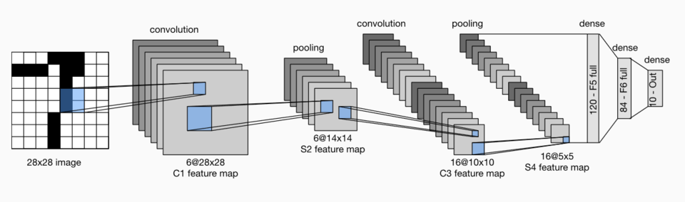
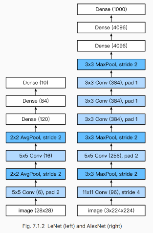

## 第五讲 卷积神经网络基础；leNet；卷积神经网络进阶

### 卷积神经网络

二维互相关运算

### leNet

1. lenet 模型介绍
2. lenet 网络搭建
3. 运用lenet进行图像识别-fashion-mnist数据集

使用全连接层的局限性：

- 图像在同一列邻近的像素在这个向量中可能相距较远。它们构成的模式可能难以被模型识别。
- 对于大尺寸的输入图像，使用全连接层容易导致模型过大。

使用卷积层的优势：

- 卷积层保留输入形状。
- 卷积层通过滑动窗口将同一卷积核与不同位置的输入重复计算，从而避免参数尺寸过大。

LeNet分为卷积层块和全连接层块两个部分。下面我们分别介绍这两个模块。

卷积层块里的基本单位是卷积层后接平均池化层：卷积层用来识别图像里的空间模式，如线条和物体局部，之后的平均池化层则用来降低卷积层对位置的敏感性。

卷积层块由两个这样的基本单位重复堆叠构成。在卷积层块中，每个卷积层都使用$5 \times 5$的窗口，并在输出上使用sigmoid激活函数。第一个卷积层输出通道数为6，第二个卷积层输出通道数则增加到16。

全连接层块含3个全连接层。它们的输出个数分别是120、84和10，其中10为输出的类别个数。

下面我们通过Sequential类来实现LeNet模型。

### 卷积神经网络进阶

LeNet:  在大的真实数据集上的表现并不尽如⼈意。     
1.神经网络计算复杂。  
2.还没有⼤量深⼊研究参数初始化和⾮凸优化算法等诸多领域。  

机器学习的特征提取:手工定义的特征提取函数  
神经网络的特征提取：通过学习得到数据的多级表征，并逐级表⽰越来越抽象的概念或模式。  

神经网络发展的限制:数据、硬件

首次证明了学习到的特征可以超越⼿⼯设计的特征，从而⼀举打破计算机视觉研究的前状。   
**特征：**
1. 8层变换，其中有5层卷积和2层全连接隐藏层，以及1个全连接输出层。
2. 将sigmoid激活函数改成了更加简单的ReLU激活函数。
3. 用Dropout来控制全连接层的模型复杂度。
4. 引入数据增强，如翻转、裁剪和颜色变化，从而进一步扩大数据集来缓解过拟合。

