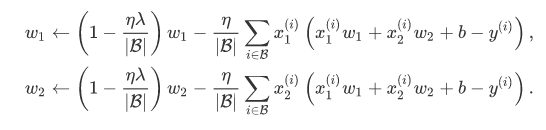
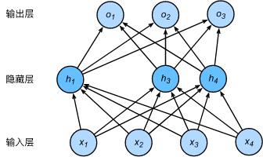

## 第三讲 过拟合、欠拟合及其解决方案；梯度消失、梯度爆炸；循环神经网络进阶

### 过拟合、欠拟合及其解决方案

#### 模型选择、过拟合和欠拟合

训练误差：模型在训练集上表现的误差
泛化误差：模型在任意一个测试数据样本上误差的期望，常常通过一份测试数据集误差来近似。

机器学习模型应关注泛化误差。

模型选择：

1. 验证数据集
2. K折交叉验证

#### 过拟合和欠拟合

#### 权重衰减

等价于正则化

#### 丢弃法

多层感知机中神经网络图描述了一个单隐藏层的多层感知机。其中输入个数为4，隐藏单元个数为5，且隐藏单元hi（i=1,…,5）的计算表达式为

$$h_i=\phi (x1w_{1i}+x2w_{2i}+x3w_{3i}+x4w_{4i}+b_i)$$

这里$\phi$是激活函数，x1,…,x4是输入，隐藏单元i的权重参数为$w_{1i},…,w_{4i}$，偏差参数为bi。当对该隐藏层使用丢弃法时，该层的隐藏单元将有一定概率被丢弃掉。设丢弃概率为p，那么有p的概率hi会被清零，有1−p的概率hi会除以1−p做拉伸。丢弃概率是丢弃法的超参数。具体来说，设随机变量ξi为0和1的概率分别为p和1−p。使用丢弃法时我们计算新的隐藏单元$h_i′$

$$h_i' = \frac{\xi_i}{1-p} h_i$$

$$E(h_i') = \frac{E(\xi_i)}{1-p}h_i = h_i$$

即丢弃法不改变其输入的期望值。让我们对之前多层感知机的神经网络中的隐藏层使用丢弃法，一种可能的结果如图所示，其中h2和h5被清零。这时输出值的计算不再依赖h2和h5，在反向传播时，与这两个隐藏单元相关的权重的梯度均为0。由于在训练中隐藏层神经元的丢弃是随机的，即h1,…,h5都有可能被清零，输出层的计算无法过度依赖h1,…,h5中的任一个，从而在训练模型时起到正则化的作用，并可以用来应对过拟合。在测试模型时，我们为了拿到更加确定性的结果，一般不使用丢弃法

