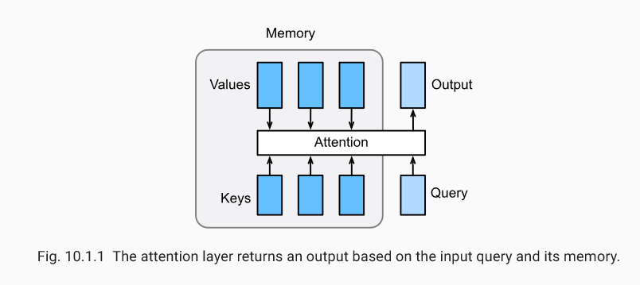
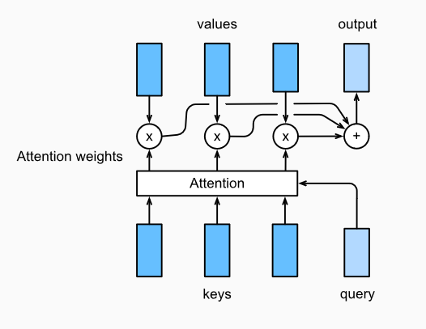
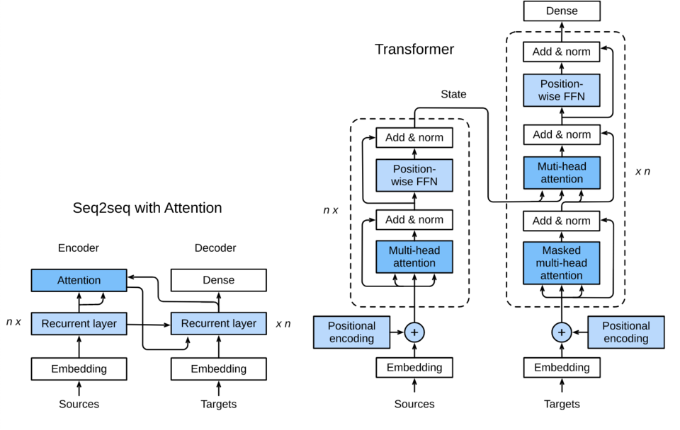

## 第四讲 机器翻译及相关技术；注意力机制与Seq2seq模型；Transformer

### 机器翻译相关技术

机器翻译（MT）：将一段文本从一种语言自动翻译为另一种语言，用神经网络解决这个问题通常称为神经机器翻译（NMT）。 主要特征：输出是单词序列而不是单个单词。 输出序列的长度可能与源序列的长度不同。

步骤：

1. 数据预处理

2. 分词

3. 建立字典

4. 载入数据集

   

### 注意力机制

在“编码器—解码器（seq2seq）”⼀节⾥，解码器在各个时间步依赖相同的背景变量（context vector）来获取输⼊序列信息。当编码器为循环神经⽹络时，背景变量来⾃它最终时间步的隐藏状态。将源序列输入信息以循环单位状态编码，然后将其传递给解码器以生成目标序列。然而这种结构存在着问题，尤其是RNN机制实际中存在长程梯度消失的问题，对于较长的句子，我们很难寄希望于将输入的序列转化为定长的向量而保存所有的有效信息，所以随着所需翻译句子的长度的增加，这种结构的效果会显著下降。

与此同时，解码的目标词语可能只与原输入的部分词语有关，而并不是与所有的输入有关。例如，当把“Hello world”翻译成“Bonjour le monde”时，“Hello”映射成“Bonjour”，“world”映射成“monde”。在seq2seq模型中，解码器只能隐式地从编码器的最终状态中选择相应的信息。然而，注意力机制可以将这种选择过程显式地建模。

### Seq2seq模型

Attention 是一种通用的带权池化方法，输入由两部分构成：询问（query）和键值对（key-value pairs）。𝐤𝑖∈ℝ𝑑𝑘,𝐯𝑖∈ℝ𝑑𝑣. Query 𝐪∈ℝ𝑑𝑞 , attention layer得到输出与value的维度一致 𝐨∈ℝ𝑑𝑣. 对于一个query来说，attention layer 会与每一个key计算注意力分数并进行权重的归一化，输出的向量o则是value的加权求和，而每个key计算的权重与value一一对应。

### Transformer

在之前的章节中，我们已经介绍了主流的神经网络架构如卷积神经网络（CNNs）和循环神经网络（RNNs）。让我们进行一些回顾：

- CNNs 易于并行化，却不适合捕捉变长序列内的依赖关系。
- RNNs 适合捕捉长距离变长序列的依赖，但是却难以实现并行化处理序列。

为了整合CNN和RNN的优势，[\[Vaswani et al., 2017\]](https://d2l.ai/chapter_references/zreferences.html#vaswani-shazeer-parmar-ea-2017) 创新性地使用注意力机制设计了Transformer模型。该模型利用attention机制实现了并行化捕捉序列依赖，并且同时处理序列的每个位置的tokens，上述优势使得Transformer模型在性能优异的同时大大减少了训练时间。

图10.3.1展示了Transformer模型的架构，与9.7节的seq2seq模型相似，Transformer同样基于编码器-解码器架构，其区别主要在于以下三点：
1. Transformer blocks：将seq2seq模型重的循环网络替换为了Transformer Blocks，该模块包含一个多头注意力层（Multi-head Attention Layers）以及两个position-wise feed-forward networks（FFN）。对于解码器来说，另一个多头注意力层被用于接受编码器的隐藏状态。
2. Add and norm：多头注意力层和前馈网络的输出被送到两个“add and norm”层进行处理，该层包含残差结构以及层归一化。
3. Position encoding：由于自注意力层并没有区分元素的顺序，所以一个位置编码层被用于向序列元素里添加位置信息。

$$
Fig.10.3.1\ Transformer 架构.
$$

